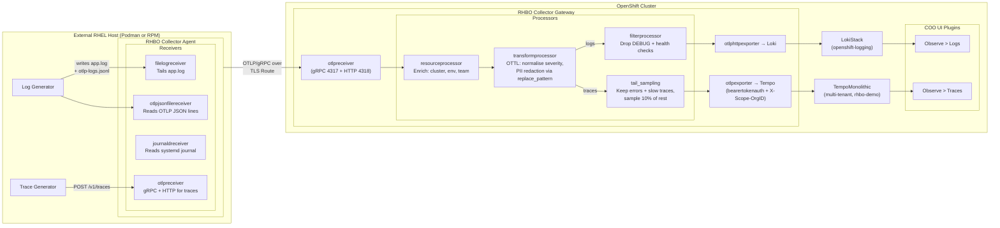

# RHBO External-to-OpenShift Observability Demo

A two-tier demo showcasing **Red Hat Build of OpenTelemetry (RHBO)** collecting telemetry from an external RHEL host, processing it with 4 processors, and storing it in OpenShift's Loki and Tempo backends — visible through the OpenShift Console.

## Architecture



## Component Summary

### Receivers (external RHEL agent)

These receivers demonstrate how RHBO can ingest telemetry from diverse external sources.

| Receiver | Signal | What it does | Data source in this demo |
|---|---|---|---|
| **filelogreceiver** | Logs | Tails plain-text log files line-by-line | `app.log` — simulated microservice logs with PII |
| **otlpjsonfilereceiver** | Logs | Reads OTLP-formatted JSON log records from files | `otlp-logs.jsonl` — structured OTLP log records with PII |
| **journaldreceiver** | Logs | Reads from the systemd journal | Host systemd journal (sshd, crond, systemd units) |
| **otlpreceiver** | Traces | Accepts OTLP gRPC/HTTP from instrumented apps | Trace generator script simulating a web application |

### Processors (OpenShift collector gateway)

These processors run on the OpenShift RHBO collector, transforming telemetry before it reaches storage.

| # | Processor | Signal | Demo behaviour | Why it matters |
|---|---|---|---|---|
| 1 | **resourceprocessor** | Logs + Traces | Adds `k8s.cluster.name=ocp-demo`, `deployment.environment=staging`, `team.name=platform-engineering` | Consistent metadata enrichment across all signals without app changes |
| 2 | **transformprocessor** | Logs + Traces | **Logs**: uppercases severity, truncates attributes, **redacts PII** (credit cards, SSNs, emails, API keys, JWTs) via OTTL `replace_pattern`. **Traces**: redacts PII from span attributes | OTTL-powered data reshaping and compliance-ready PII scrubbing — no code changes needed |
| 3 | **filterprocessor** | Logs | Drops `DEBUG`-level logs and health-check probes (`/healthz`, `/ready`) | Reduce storage costs and improve signal-to-noise ratio |
| 4 | **tail_sampling** | Traces | Keeps all `ERROR` traces, keeps traces slower than 1s, probabilistically samples 10% of the rest | Intelligent trace retention — focus on what matters, reduce storage by ~70% |

### Backends (OpenShift)

| Component | Purpose | Namespace |
|---|---|---|
| **LokiStack** | Log storage and querying | `openshift-logging` |
| **TempoMonolithic** | Trace storage and querying (multi-tenant) | `rhbo-demo` |
| **MinIO** | S3-compatible object storage (demo only) | `openshift-logging` |
| **COO Logging UIPlugin** | Observe > Logs in OpenShift Console (`otel` schema) | cluster-scoped |
| **COO Tracing UIPlugin** | Observe > Traces in OpenShift Console | cluster-scoped |

### Operators Installed

| Operator | Subscription | Namespace | Channel |
|---|---|---|---|
| Red Hat build of OpenTelemetry | `opentelemetry-product` | `openshift-opentelemetry-operator` | `stable` |
| Loki Operator | `loki-operator` | `openshift-operators-redhat` | `stable-6.6` |
| Tempo Operator | `tempo-product` | `openshift-tempo-operator` | `stable` |
| Cluster Observability Operator | `cluster-observability-operator` | `openshift-cluster-observability-operator` | `stable` |

---

## Prerequisites

### OpenShift Cluster
- OpenShift 4.14+ with `oc` CLI authenticated as `cluster-admin`
- A default `StorageClass` (for MinIO PVC — adjust `storageClassName` in LokiStack if needed)

### External RHEL Host
- RHEL 9 (or Fedora/CentOS Stream 9) with Podman installed
- **OR** bare-metal with `dnf install opentelemetry-collector` for RPM-based deployment
- Network access to the OpenShift cluster (HTTPS to the collector Route)

---

## Quick Start

### Step 1: Deploy OpenShift Backend

```bash
cd openshift/
./deploy.sh
```

This will:
1. Install all 4 operators (RHBO, Loki, Tempo, COO) and wait for each CSV to succeed
2. Deploy MinIO object storage and create S3 buckets
3. Deploy LokiStack and TempoMonolithic
4. Deploy the RHBO collector gateway with OTLP receiver + 4 processors
5. Create a TLS Route for external OTLP ingestion
6. Enable COO UI plugins for Observe > Logs and Observe > Traces

The script prints the Route URL at the end — you'll need it for the external agent.

### Step 2: Start External Agent

#### Option A: Podman (recommended for demo)

```bash
cd external/

# Set the OpenShift Route URL from Step 1
export OTEL_EXPORTER_OTLP_ENDPOINT=https://<route-from-step-1>

# Edit podman-compose.yaml to set the OTEL_EXPORTER_OTLP_ENDPOINT
# Then start:
podman-compose up
```

#### Option B: RHEL RPM (bare-metal)

```bash
# Install the RHBO collector
sudo dnf install -y opentelemetry-collector

# Copy the config
sudo cp external/collector-agent.yaml /etc/opentelemetry-collector/config.yaml

# Set the endpoint
sudo systemctl set-environment OTEL_EXPORTER_OTLP_ENDPOINT=https://<route-from-step-1>

# Start the service
sudo systemctl enable --now opentelemetry-collector.service

# Start the log/trace generators
export LOG_DIR=/var/log/demo && mkdir -p $LOG_DIR
./external/scripts/generate-logs.sh &
./external/scripts/generate-traces.sh &
```

### Step 3: Verify

```bash
# Watch the OpenShift collector processing logs
oc logs -f deployment/rhbo-collector-gateway -n rhbo-demo

# Open the OpenShift Console:
#   Observe > Logs   — see filtered, PII-redacted logs
#   Observe > Traces — see tail-sampled traces (errors + slow requests)
```

---

## What to Look For

### In the Collector Logs (`oc logs`)

1. **Resource enrichment** — every log/trace has `k8s.cluster.name`, `deployment.environment`, `team.name`
2. **PII redaction** — credit cards (`4111-1111-1111-1111`), SSNs (`123-45-6789`), emails replaced with `****`
3. **Filtered out** — no DEBUG-level logs, no `/healthz` or `/ready` probes
4. **Tail sampling** — only error traces, slow traces (>1s), and ~10% of normal traces retained

### In OpenShift Console > Observe > Logs

- Query by `deployment.environment = staging`
- Verify PII is scrubbed — search for email patterns, you should only see `****`
- No DEBUG or health-check logs present

### In OpenShift Console > Observe > Traces

- Select the `rhbo-tempo` Tempo instance and `rhbo-demo` tenant
- Error traces are always present (red status)
- Slow traces (>1s) are always present
- Only ~10% of fast/normal traces are retained
- Jaeger UI available via route: `https://tempo-rhbo-tempo-gateway-rhbo-demo.<domain>/api/traces/v1/rhbo-demo/search`

---

## Project Structure

```
├── external/                                 # External RHEL host
│   ├── collector-agent.yaml                  # RHBO agent config (4 receivers, OTLP export)
│   ├── podman-compose.yaml                   # Podman Compose: log-gen + trace-gen + collector
│   ├── data/
│   │   ├── app.log                           # Pre-seeded app logs with PII
│   │   └── otlp-logs.jsonl                   # Pre-seeded OTLP JSON logs with PII
│   └── scripts/
│       ├── generate-logs.sh                  # Continuous log generator (bash)
│       └── generate-traces.sh                # Continuous trace generator (curl + OTLP JSON)
│
├── openshift/                                # OpenShift backend
│   ├── operators/
│   │   ├── 00-rhbo-operator.yaml             # RHBO Operator install
│   │   ├── 01-loki-operator.yaml             # Loki Operator install
│   │   ├── 02-tempo-operator.yaml            # Tempo Operator install
│   │   └── 03-coo-operator.yaml              # COO install
│   ├── backend/
│   │   ├── 10-namespace.yaml                 # rhbo-demo + openshift-logging namespaces
│   │   ├── 11-minio.yaml                     # MinIO (S3 object storage for demo)
│   │   ├── 12-lokistack.yaml                 # LokiStack CR
│   │   └── 13-tempo-monolithic.yaml          # TempoMonolithic CR
│   ├── collector/
│   │   ├── 20-collector-gateway.yaml         # RHBO collector: OTLP → processors → Loki/Tempo
│   │   ├── 21-route.yaml                     # TLS Route for external OTLP ingestion
│   │   └── 22-rbac.yaml                     # SA + ClusterRoles for Loki + multi-tenant Tempo auth
│   ├── ui/
│   │   ├── 30-uiplugin-logging.yaml          # COO Logging UI (Observe > Logs)
│   │   └── 31-uiplugin-tracing.yaml          # COO Tracing UI (Observe > Traces)
│   └── deploy.sh                             # One-command phased deploy
│
└── README.md                                 # This file
```

---

## RHBO Deployment Models

This demo showcases **both** supported RHBO deployment models:

| Deployment | Where | How | What it proves |
|---|---|---|---|
| **RHEL RPM agent** | External RHEL host | `dnf install opentelemetry-collector` | RHBO works standalone on RHEL — collects from files, journal, and OTLP |
| **OpenShift Operator** | OpenShift cluster | RHBO Operator + raw Deployment | RHBO works on OpenShift — processes, enriches, and routes telemetry to Loki/Tempo |

Both are **Red Hat supported** with the same collector binary and the same [component manifest](https://github.com/os-observability/redhat-opentelemetry-collector/blob/main/manifest.yaml).

---

## Demo Talk Track

### Opening

> "Today I'll show you how Red Hat Build of OpenTelemetry handles the full telemetry lifecycle — from collection on external RHEL hosts, through intelligent processing, to storage and visualization on OpenShift."

### Receiver Story

> "On our external RHEL host, the RHBO collector agent — installed via a simple `dnf install` — is reading from three different source types:
>
> 1. A **file log receiver** tailing a standard application log — the kind you'd find on any Linux server
> 2. An **OTLP JSON file receiver** consuming structured telemetry exports written by applications
> 3. A **journald receiver** reading directly from the systemd journal — capturing system-level events like SSH logins
> 4. An **OTLP receiver** accepting traces from instrumented applications
>
> All of this telemetry is shipped over a TLS-encrypted OTLP connection to our OpenShift cluster."

### Processor Walkthrough

> "On the OpenShift side, the RHBO collector gateway applies four processors before any data touches storage."

**1. Resource Processor**
> "Every log and trace is enriched with cluster name, deployment environment, and team ownership. This metadata is injected at the collector level — zero changes to any application code."

**2. Transform Processor (with PII Redaction)**
> "The transform processor uses OTTL — the OpenTelemetry Transformation Language — to do two things. First, it normalises data: uppercasing severity text, truncating oversized attributes. Second, and critically, it **redacts all PII**. Watch — credit card numbers, Social Security Numbers, email addresses, API keys — all replaced with `****` using regex-based `replace_pattern` rules. This data never reaches Loki or Tempo. Compliance-ready telemetry, enforced at the infrastructure level."

**3. Filter Processor**
> "The filter processor eliminates noise. All those DEBUG-level health-check logs — `/healthz`, `/ready` — that flood your observability backend? Dropped before storage. This directly reduces your Loki storage costs and improves the signal-to-noise ratio for operators."

**4. Tail Sampling Processor**
> "For traces, we use tail sampling — which evaluates the complete trace before deciding whether to keep it. Our policy: always keep error traces, always keep slow traces over 1 second, and probabilistically sample just 10% of everything else. The result? You keep 100% of the interesting traces while reducing storage by roughly 70%."

### Backend Story

> "The processed data flows into two Red Hat-supported backends:
> - **Loki** for logs — deployed via the Loki Operator with a LokiStack custom resource
> - **Tempo** for traces — deployed via the Tempo Operator as a TempoMonolithic instance **with multitenancy enabled**
>
> Tempo multitenancy is configured with OpenShift mode, meaning authentication uses native OpenShift OAuth and TokenReview, and authorization uses SubjectAccessReview. The collector authenticates using a ServiceAccount bearer token and sends an `X-Scope-OrgID` header to route traces to the correct tenant. RBAC ClusterRoles control who can write (the collector) and read (Console users) trace data. This is the same isolation model you'd use in production with multiple teams sharing a single Tempo instance.
>
> Both use MinIO for S3-compatible storage in this demo, but you'd swap in AWS S3, Azure Blob, or ODF in production."

### Console Visualization

> "And finally, the Cluster Observability Operator gives us native OpenShift Console integration. Under **Observe > Logs**, you can query and filter the processed logs — notice there's no PII anywhere, no debug noise. Under **Observe > Traces**, you can see the sampled traces — mostly errors and slow requests, exactly what your SRE team needs."

### Closing

> "Four receivers, four processors, two backends, native console integration — all powered by Red Hat Build of OpenTelemetry. Supported on RHEL for edge collection, supported on OpenShift for central processing. One collector binary, two deployment models, complete observability."

---

## Log Schema: viaq vs otel

The OpenShift Console Logging UI supports two log data models (schemas). This demo sets both sets of labels so either schema works.

### viaq (ViaQ)

The original OpenShift logging data model, designed for the EFK (Elasticsearch-Fluentd-Kibana) stack and later adapted for Loki. It uses flat, underscore-delimited label names derived from Kubernetes metadata. This is the **default** schema generated by the ClusterLogForwarder (Red Hat OpenShift Logging Operator).

### otel (OpenTelemetry)

The industry-standard [OpenTelemetry semantic conventions](https://opentelemetry.io/docs/specs/semconv/) data model. It uses dot-delimited names (which become underscores in Loki). This is the schema generated when logs are forwarded via the OTLP protocol — which is what our RHBO collector uses.

### Side-by-side comparison

| Concept | viaq label | otel label |
|---|---|---|
| Namespace | `kubernetes_namespace_name` | `k8s_namespace_name` |
| Pod | `kubernetes_pod_name` | `k8s_pod_name` |
| Container | `kubernetes_container_name` | `k8s_container_name` |
| Log type | `log_type` | `openshift_log_type` |
| Severity | `level` | `severity_text` |

### Why both exist

Red Hat is transitioning from viaq to otel as the standard logging data model:

- **viaq** is the legacy model (GA, fully supported, current default)
- **otel** is the future model (aligns with the broader OpenTelemetry ecosystem)

The `select` option in the Console UIPlugin lets users pick which schema to query with. In this demo, the RHBO collector gateway sets both viaq-style and otel-style resource attributes so the Console works regardless of which schema is selected. In production, once the transition to OpenTelemetry-native logging is complete, `otel` will become the default.

---

## Customisation

### Swap MinIO for production storage

Replace the MinIO secrets with your real S3/Azure/GCS credentials. Update `storageClassName` in the LokiStack CR to match your cluster.

### Add more processor rules

Edit `openshift/collector/20-collector-gateway.yaml` to add more OTTL transform rules, filter conditions, or tail sampling policies.

### Use OpenTelemetryCollector CR

Instead of the raw Deployment in `20-collector-gateway.yaml`, you can use the operator-managed `OpenTelemetryCollector` CR for automatic upgrades and lifecycle management.

### Supported components

See the full [RHBO manifest](https://github.com/os-observability/redhat-opentelemetry-collector/blob/main/manifest.yaml) for all supported receivers, processors, exporters, connectors, and extensions.

---

## Teardown

```bash
# Remove demo workloads only (keeps operators for reuse)
cd openshift/
./deploy.sh --teardown

# Remove everything including all 4 operators
./deploy.sh --teardown-all
```
